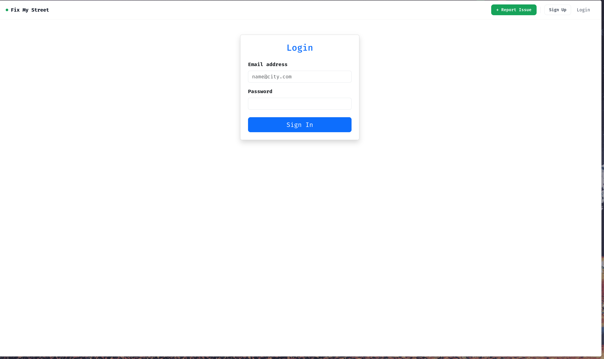
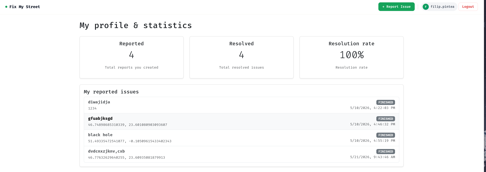
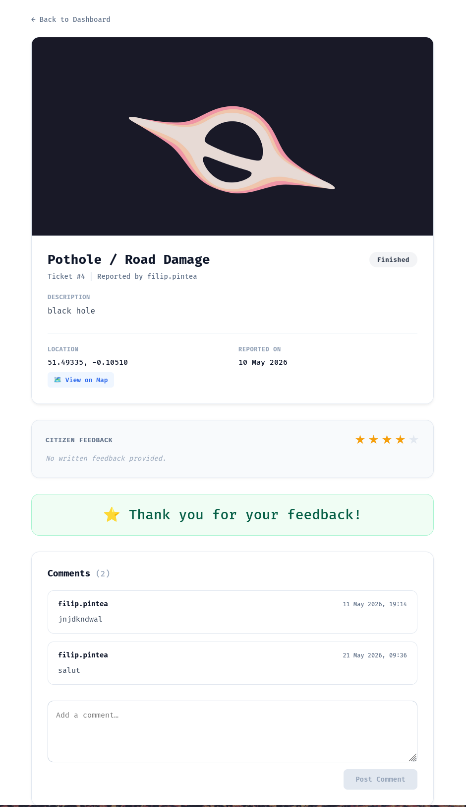
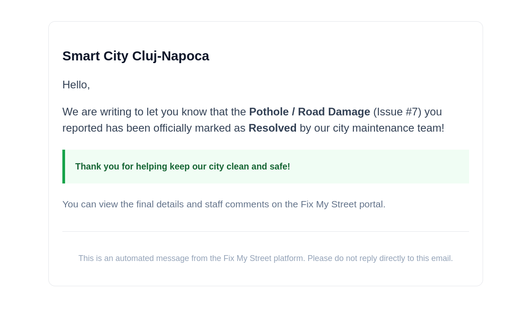
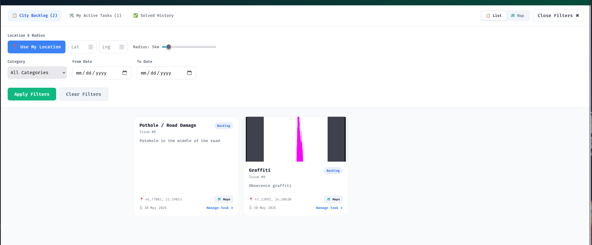

## Application Gallery

### Citizen Experience

**Reporting Interface**

*An interactive map interface allowing citizens to easily pinpoint, categorize, and report local infrastructure issues.*

**Secure Authentication**

*A secure, role-based login portal distinguishing between everyday citizens and administrative city workers.*

**Citizen Dashboard**

*A personalized dashboard where citizens can track the real-time status of their submitted reports.*

**Impact Analytics**

*An analytics page providing citizens with insights into their reporting history and the city's overall resolution rate.*

**Issue Details & Feedback**

*A detailed view of a specific ticket, featuring a dedicated comment section and a post-resolution feedback mechanism.*

**Automated Notifications**

*Asynchronous email alerts triggered by the backend to notify citizens the moment their reported issue is marked as resolved by city staff.*
---

### City Worker Experience

**Geospatial Backlog**

*A global backlog filtering system that helps city workers find nearby unassigned tasks using map radius controls.*

**Task Management**

*A focused view of the tasks a city worker has actively claimed and is currently in the process of resolving.*

**Staff Controls**

*The administrative interface where city workers govern the state machine and officially update a ticket's status.*

**Resolution History (Grid)**

*A historical grid showcasing a worker's successfully resolved municipal issues.*

**Resolution History (Map)**

*An interactive map view allowing staff to visualize geographical clusters of completed work across the city.*

---

## Tech Stack

* **Frontend:** React.js, Vite, Bootstrap, Leaflet (Maps)
* **Backend:** Java 21, Spring Boot, Spring Security (JWT)
* **Database:** PostgreSQL, H2 (Testing)
* **Architecture:** RESTful API, N-Tier Architecture, Facade Pattern, DTO Pattern

## Getting Started

### Prerequisites
* Java 21+
* Node.js & npm
* PostgreSQL running locally

### Backend Setup
1. Clone the repository and navigate to the backend directory.
2. Update `application.properties` with your PostgreSQL credentials.
3. Run `mvn clean install` to install dependencies.
4. Run the Spring Boot application via your IDE or `mvn spring-boot:run`.

### Frontend Setup
1. Navigate to the frontend directory.
2. Run `npm install` to download React dependencies.
3. Run `npm run dev` to start the Vite development server.
4. Open `http://localhost:5173` in your browser.